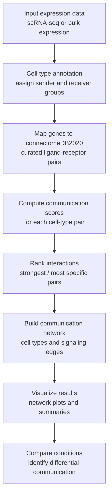

# Predicting Cell-to-Cell Communication Networks Using NATMI

**DOI:** 10.1038/s41467-020-18873-z

## Paper Brief
NATMI (Network Analysis Toolkit for Multicellular Interactions) is a method for predicting and visualizing cell-to-cell communication networks from single-cell or bulk expression data. It uses the curated connectomeDB2020 ligand-receptor database to infer which cell types communicate most strongly, which ligand-receptor pairs are most active or specific, and how communication changes across conditions.

The main value of the paper is that it turns gene expression into an interpretable cell-communication network. Instead of only listing expressed genes, it ranks sender-receiver cell-type pairs, highlights likely signaling pairs, and supports comparison between conditions.

## Methodology Workflow

## Key Outputs
- Communicating cell-type pairs.
- Active or specific ligand-receptor pairs.
- Cellular communities with strong communication.
- Differences in signaling across experimental conditions.

## Why It Matters
- Useful when the main question is **who is talking to whom** in a tissue.
- Good for interpreting intercellular signaling in single-cell or bulk datasets.
- Strong for network-level communication analysis, not for pathway-based phenotype prediction.

## Practical Notes
- NATMI relies on a ligand-receptor reference database, so its results depend on the quality of that catalog.
- It is best suited for communication inference rather than direct supervised modeling of clinical outcomes.
- Compared with RNAchat, it is more focused on cell-cell signaling and less focused on ICA-derived metapathways.
